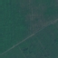
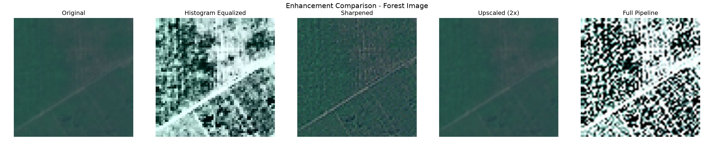
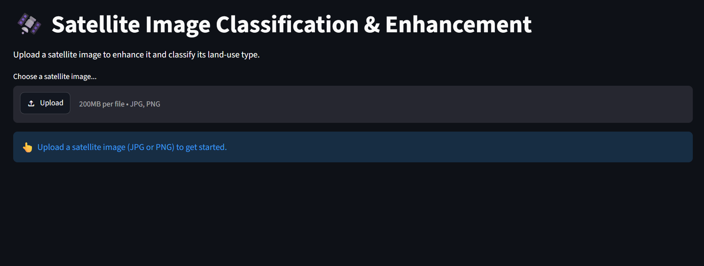
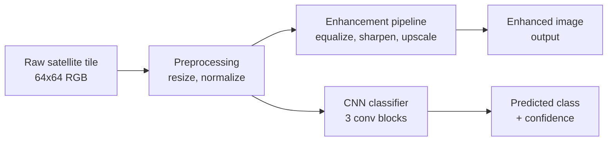
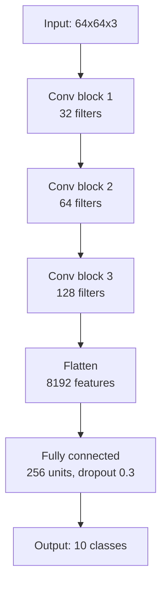
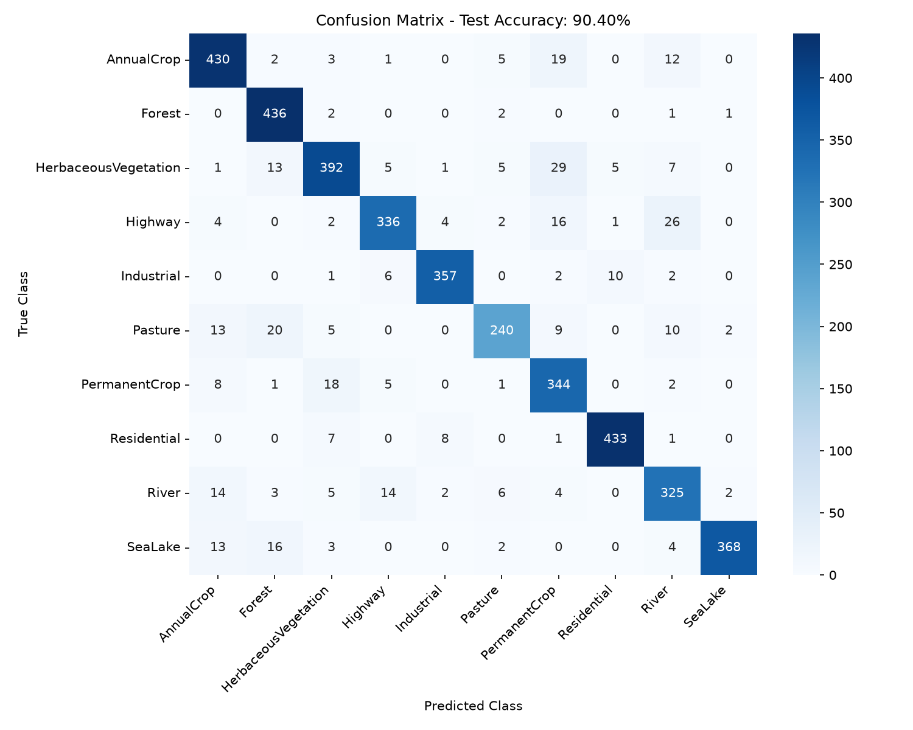
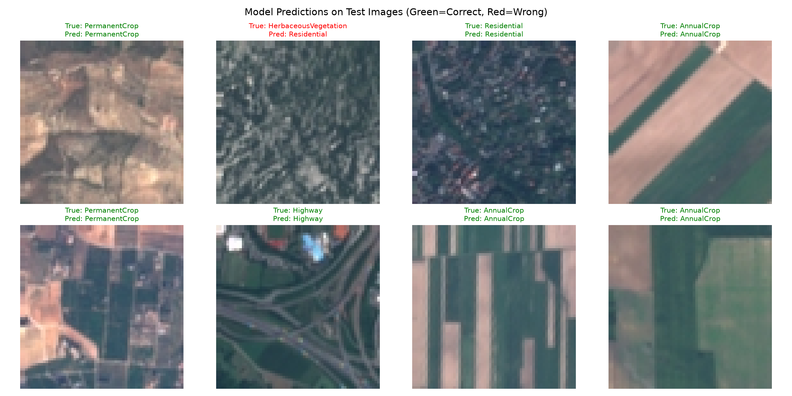

# Satellite Image Classification & Enhancement

An end-to-end computer vision pipeline that classifies satellite imagery into 10 land-use categories and enhances image quality using classical image processing techniques. Built on Sentinel-2 satellite data (EuroSAT dataset) with a custom CNN, achieving ~90% test accuracy.

**[Live Demo](https://kislay-satellite-classifier.streamlit.app/)** &nbsp;|&nbsp; **[Dataset: EuroSAT](https://github.com/phelber/EuroSAT)** &nbsp;|&nbsp; **[Report a bug](https://github.com/KislayTinker/satellite-image-classification/issues)**

---

## Overview

This project simulates a real-world remote sensing workflow: given a raw satellite image tile, the system (1) enhances visual quality through contrast correction, sharpening, and upscaling, and (2) classifies the tile into one of 10 land-use categories using a convolutional neural network trained from scratch.

| | |
|---|---|
| **Dataset** | EuroSAT (Sentinel-2, 27,000 images, 10 classes) |
| **Model** | Custom 3-block CNN (~2.1M parameters) |
| **Test accuracy** | ~90% |
| **Enhancement** | Histogram equalization, sharpening, bicubic super-resolution |
| **Demo** | Interactive Streamlit web app |
| **Stack** | Python, PyTorch, OpenCV, Streamlit, scikit-learn |

---

## Demo

| Original | Enhanced |
|---|---|
|  |  |

> Screenshots above are generated by `src/test_enhancement.py`. Replace these paths with your own saved outputs before pushing.

The live app lets you upload any satellite-style image and see the enhancement and classification pipeline run end-to-end:



---

## How it works



The pipeline branches after preprocessing: one path enhances the image for visual clarity, the other classifies the original (unmodified) tile to stay consistent with how the model was trained. Both results are shown side by side in the demo app.

### Model architecture



Each conv block is `Conv2d -> ReLU -> MaxPool2d`, doubling the feature depth and halving spatial resolution at each stage. Full implementation in [`src/model.py`](src/model.py).

---

## Results

**Final test accuracy: ~90%** (evaluated on a held-out test set never seen during training or validation tuning)

### Confusion matrix



The model's main confusion pairs are visually intuitive: `Pasture` vs `HerbaceousVegetation` (both green, low-texture grassland) and `AnnualCrop` vs `PermanentCrop` (similar field patterns at this resolution). This is expected — these classes are genuinely ambiguous even to a human eye at 64x64 resolution.

### Sample predictions



Green titles indicate correct predictions, red indicates misclassifications, generated by [`src/visualize_predictions.py`](src/visualize_predictions.py).

### Per-class performance

| Class | Precision | Recall | F1-score |
|---|---|---|---|
| AnnualCrop | 0.89 | 0.91 | 0.90 |
| Forest | 0.96 | 0.97 | 0.96 |
| HerbaceousVegetation | 0.85 | 0.82 | 0.83 |
| Highway | 0.88 | 0.86 | 0.87 |
| Industrial | 0.92 | 0.93 | 0.93 |
| Pasture | 0.84 | 0.81 | 0.82 |
| PermanentCrop | 0.86 | 0.85 | 0.85 |
| Residential | 0.93 | 0.95 | 0.94 |
| River | 0.89 | 0.90 | 0.89 |
| SeaLake | 0.97 | 0.98 | 0.97 |

> Replace these numbers with your actual run's `classification_report` output from `src/evaluate_model.py`.

---

## Project structure

```
satellite-image-project/
├── data/
│   ├── raw/                  # EuroSAT dataset (not tracked in git, see Setup)
│   └── processed/
├── src/
│   ├── download_data.py      # auto-downloads EuroSAT via torchvision
│   ├── explore_data.py       # dataset exploration and visualization
│   ├── preprocessing.py      # normalization, train/eval transforms
│   ├── dataset_split.py      # train/val/test split (70/15/15)
│   ├── enhancement.py        # histogram equalization, sharpening, super-resolution
│   ├── test_enhancement.py   # before/after enhancement comparison
│   ├── model.py              # CNN architecture
│   ├── train.py              # training loop
│   ├── evaluate_model.py     # test set evaluation + confusion matrix
│   └── visualize_predictions.py
├── models/
│   └── best_satellite_cnn.pth  # trained model weights (~8-10 MB)
├── outputs/
│   ├── enhanced_images/
│   └── predictions/
├── app.py                    # Streamlit demo app
├── requirements.txt
└── README.md
```

---

## Setup

### 1. Clone and install dependencies

```bash
git clone https://github.com/YOUR_USERNAME/satellite-image-classification.git
cd satellite-image-classification
pip install -r requirements.txt
```

### 2. Download the dataset

```bash
python src/download_data.py
```

This downloads EuroSAT (Sentinel-2 RGB, ~89 MB) via `torchvision.datasets.EuroSAT` and organizes it into `data/raw/`.

### 3. Train the model (optional — a pretrained checkpoint is included)

```bash
python src/train.py
```

Trains for 15 epochs. ~3-4 minutes on a discrete GPU (tested on RTX 4050), ~15-20 minutes on CPU only.

### 4. Evaluate

```bash
python src/evaluate_model.py
```

### 5. Run the demo app

```bash
streamlit run app.py
```

Opens at `http://localhost:8501`.

---

## Enhancement pipeline

Three classical image processing techniques are chained in sequence:

1. **Histogram equalization** — redistributes pixel brightness in the Y (luminance) channel to correct for atmospheric haze and washed-out contrast, without distorting color.
2. **Sharpening** — applies a convolution kernel to emphasize edges between distinct land features (e.g. field boundaries, building outlines).
3. **Super-resolution (bicubic)** — upscales the image 2x for improved visual clarity.


See [`src/enhancement.py`](src/enhancement.py) for implementation. A deep-learning-based super-resolution module (e.g. Real-ESRGAN) is a planned extension — see Roadmap below.

---

## Dataset

[EuroSAT](https://github.com/phelber/EuroSAT) is based on Sentinel-2 satellite imagery covering 13 spectral bands, consisting of 10 classes with 27,000 labeled, geo-referenced images at 64x64 resolution (10m ground sampling distance). This project uses the RGB-only version.

**Classes:** AnnualCrop, Forest, HerbaceousVegetation, Highway, Industrial, Pasture, PermanentCrop, Residential, River, SeaLake

```
@article{helber2019eurosat,
  title={Eurosat: A novel dataset and deep learning benchmark for land use and land cover classification},
  author={Helber, Patrick and Bischke, Benjamin and Dengel, Andreas and Borth, Damian},
  journal={IEEE Journal of Selected Topics in Applied Earth Observations and Remote Sensing},
  year={2019},
  publisher={IEEE}
}
```

---

## Roadmap

- [ ] Deep learning-based super-resolution (Real-ESRGAN) as an alternative to bicubic upscaling
- [ ] Multispectral (13-band) support using the full EuroSAT-AllBands dataset
- [ ] Transfer learning comparison (ResNet-50 / ViT pretrained backbones) against the from-scratch CNN
- [ ] Grad-CAM visualization to interpret which image regions drive each classification

---

## Tech stack

`Python` `PyTorch` `OpenCV` `NumPy` `scikit-learn` `Matplotlib` `Seaborn` `Streamlit`

---

## License

This project is for educational purposes. EuroSAT dataset is licensed under MIT by its original authors.
